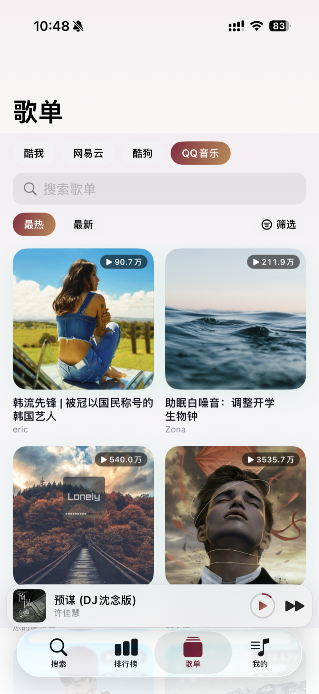
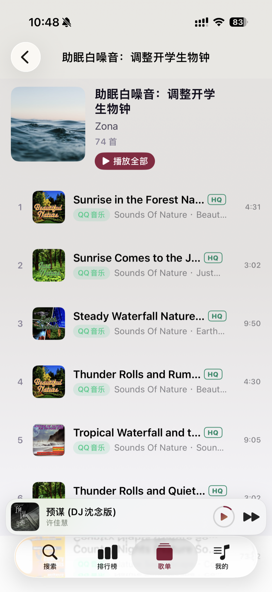

# shuhao music

> 让每一段旋律,都有归属。

> 一款 **原生 SwiftUI 的 iPhone 音乐播放器**（iOS），使用 **Swift 6 + SwiftUI + JavaScriptCore** 编写，**安装后需先在设置页面配置自定义音源**，否则播放不了音乐。

<p>
  
  
  
  
</p>

[lx-music-mobile](https://github.com/lyswhut/lx-music-mobile)（洛雪音乐）的 iOS 生态复刻与再设计：保留 **lx-music v4 自定义源 JS 解析协议**，聚合 **酷我 / 网易云 / 酷狗 / QQ 音乐** 四平台的搜索、排行榜与歌单，扩展到 **8 级音质**（最高臻品母带），并深度接入苹果生态 —— Siri 点歌、AirPlay、iCloud 同步、锁屏/控制中心控件。

> 🤖 本项目的**全部代码均由 [Claude Code](https://claude.com/claude-code) 生成**（含架构、UI、播放/下载/导入逻辑与本文档）。

---

## 📱 界面预览

| iPhone · 播放页（Hi-Res 规格实测标注） | 封面取色的动态背景 | 歌单广场 | 歌单详情 |
|:--:|:--:|:--:|:--:|
|  |  |  |  |

---

## 📥 安装

本项目不上架 App Store，需自行用 Xcode 构建安装到 iPhone：

- **iPhone**：用 Xcode 打开 `shuhao.xcodeproj`，改成自己的开发者签名后安装到设备（免费 Apple ID 亦可，7 天需重签）。

安装后第一件事：**设置 → 自定义音源**，通过 URL / 粘贴脚本 / 选择文件导入 lx-music v4 兼容脚本（App 不内置任何音源）。

---

## ✨ 功能特性

| 分区 | 说明 |
|---|---|
| **搜索** | 四平台聚合搜歌（全部 tab 汇总 + 单平台筛选），支持歌词搜索、搜索历史；结果带音质（SQ/Hi-Res）与 MV 角标 |
| **排行榜** | 各平台官方榜单浏览 → 榜内歌曲 → 播放 / 下载 / 收藏 |
| **歌单广场** | 按平台浏览推荐歌单（最热/最新排序 + 各平台专属标签筛选），歌单关键字搜索 |
| **在线歌单导入** | 粘贴 **酷我 / 酷狗 / QQ / 网易云** 歌单分享链接（含微信分享新格式）一键**全量导入**——网易云走两步接口拿全曲目，千首大歌单分批写入不卡顿 |
| **资料库** | 继续听、最近播放、我的歌单、听歌报告（播放统计）；歌单 iCloud 多端同步 |
| **下载** | 多音质下载，按 `歌手/专辑/曲目` 目录整理，内嵌完整元数据（标题/歌手/专辑/封面/歌词） |
| **本地导入** | 选择文件夹递归扫描导入本地音乐，自动读取内嵌标签 |
| **播放页** | 封面取色动态背景、网易云黑胶唱片（静态）、滚动歌词、**实测音频规格标注**（如 `FLAC 24bit/44.1kHz`，探测自真实流而非接口宣称） |
| **播放能力** | 10 段 EQ 均衡器、AirPlay、睡眠定时、后台播放、锁屏/控制中心/CarPlay 控件、MV 播放 |
| **系统集成** | Siri / App Shortcuts（"用 shuhao music 播放晴天"） |
| **设置 / 自定义源** | 音质偏好，URL / 粘贴 / 文件三种方式导入管理 lx-music v4 脚本 |

---

## 🎵 支持的音乐平台

| 平台 | 代码 | 搜索 | 排行榜 | 歌单 | 在线歌单导入 |
|---|---|:--:|:--:|:--:|:--:|
| 酷我音乐 | `kw` | ✅ | ✅ | ✅ | ✅ |
| 酷狗音乐 | `kg` | ✅ | ✅ | ✅ | ✅ |
| QQ 音乐 | `tx` | ✅ | ✅ | ✅ | ✅ |
| 网易云音乐 | `wy` | ✅ | ✅ | ✅ | ✅ |
| 本地文件 | `local` | — | — | — | （本地导入） |

> 目录数据（搜索 / 排行榜 / 歌单）走各平台直连 API，由 App 原生实现——浏览体验不依赖脚本质量；播放地址解析由自定义源脚本完成，**纯脚本模式**(无任何平台直连兜底);解析失败直接报错,不会静默回落。

---

## 🎧 音质档位

8 级音质体系，从高到低排序，播放/下载按「目标音质 → 逐级降级」级联选取：

| 档位 | key | 显示名 | 角标 |
|---|---|---|---|
| 母带 | `master` | 臻品母带 | Master |
| 全景声 2.0 | `atmos_plus` | 臻品全景声 2.0 | Atmos |
| 全景声 | `atmos` | 臻品全景声 | Atmos |
| 高解析 | `hires` | Hi-Res 高解析 | Hi-Res |
| 24bit 无损 | `flac24bit` | Hi-Res 24bit | Hi-Res |
| 无损 | `flac` | 无损 FLAC | SQ |
| 高品 | `320k` | 高品 320k | HQ |
| 标准 | `128k` | 标准 128k | —（列表不显示角标） |

可靠性设计（对齐真实音源的各种"不老实"）：

- **脚本声明即可尝试**：无损及以上档位不要求平台元数据先上报，脚本说有就试；
- **URL 级降级**：音源拼出的高音质地址 404/403 时自动降一档重试，每档只试一次，成功档位同曲复用；
- **解码兜底**：AVFoundation 拒收的 Hi-Res FLAC 自动切内置 **libFLAC 解码器**再试，仍失败才降档。

---

## 🎨 设计风格

- **品牌色**：酒红 `#8B2440` → 古铜金 `#C18A4F` 渐变（主按钮 / 进度条 / 选中态），磁带米黄 `#E8C99A` 呼应 "Shuhao" 拟物元素；明暗双外观自适应。
- **播放页封面驱动**：背景从封面取色渐变，配网易云黑胶唱片、逐行滚动歌词；音质规格（`FLAC 24bit/44.1kHz`）实测标注。
- **平台辨识色**：酷我橙 / 酷狗蓝 / QQ 绿 / 网易红，用于 chip、卡片投影与占位图；音质角标同样有专属色阶（母带赤铜 / 全景声蓝 / Hi-Res 金 / 无损紫 / HQ 青绿）。
- **iPhone 原生布局**：底部 tab + 全屏播放页——不套用 iPad / Mac 的视觉语言。
- 统一设计 token（`DesignSystem.swift`）：32pt Heavy Rounded 大标题、8/12/18/28 四级圆角、系统化间距与阴影。

---

## 🧩 自定义源（基于洛雪音乐 lx-music 协议）

本项目保留并复刻了 **lx-music v4 用户脚本协议**，可直接加载社区常见的自定义源脚本：

- `JSRuntime.swift` 在 **JavaScriptCore** 上下文运行脚本，复刻预加载契约（`lx_setup` / `__lx_native__` / `__lx_native_call__*`），预加载脚本为 `Resources/user-api-preload.js`；
- 脚本发起的 HTTP 请求由 host 的 **URLSession** 代理执行（脚本本身无网络权限），对齐 lx-music-mobile 的 UA / 编码规则；
- 加解密（AES / RSA / MD5 / Base64）由 host 注入的 `CryptoBridge` 提供；
- 脚本只负责 **musicUrl / lyric / pic** 三个动作，搜索/排行榜/歌单全部为平台直连；
- `SourceManager` 负责脚本加载、能力协商（各平台支持的档位）、音质级联与跨平台换源。

导入方式：设置页粘贴脚本 URL / 直接粘贴脚本内容 / 选择 `.js` 文件。

---

## 🛠 技术栈

- **Swift 6** + **SwiftUI**（`-default-isolation=MainActor` 全局主隔离，数据/解析类型显式 `nonisolated + Sendable`）
- **AVFoundation**（AVPlayer + MTAudioProcessingTap 实现 10 段 EQ）+ 内置 **libFLAC** Hi-Res 解码兜底
- **JavaScriptCore**（运行 lx v4 自定义源脚本）
- **App Intents / SiriKit**（Siri 点歌与快捷指令）
- **Combine + ObservableObject** 状态管理；JSON 文件 + iCloud KVS（`NSUbiquitousKeyValueStore`）持久化/同步

---

## 📦 项目结构

```
shuhao/
├── shuhaoApp.swift / RootTabView        应用入口 + iPhone 布局
├── PlaybackEngine / HiResFLACPlayer      播放内核 + 音质降级链 + libFLAC 兜底
├── EQAudioTap / Equalizer                10 段 EQ（MTAudioProcessingTap）
├── JSRuntime / SourceManager             lx v4 脚本运行时 + 能力协商/选档/换源
├── Catalogs / Songlists / Boards         四平台直连：搜索 / 歌单 / 排行榜
├── SonglistImporter                      在线歌单链接解析与全量导入
├── Stores / CloudSync                    歌单/脚本/设置持久化 + iCloud 同步
├── DownloadStore / AudioMetadataWriter   下载管理 + 元数据嵌入
├── Lyrics / MvResolver                    歌词 / MV
└── Resources/user-api-preload.js         lx 协议预加载脚本（不可删改）
docs/          功能规格与截图
```

---

## 🚀 构建与运行

环境：**Xcode 26**（iOS 26 SDK），**部署目标 iOS 16**。工程使用 Xcode 16+ 的同步文件夹（`PBXFileSystemSynchronizedRootGroup`），增删文件无需手改 pbxproj。

### 1. 换成你自己的签名团队（真机必需，模拟器可跳过）

工程里预置的 `DEVELOPMENT_TEAM` 是原作者的，你**没有**该团队的账号，直接编译会报 `No account for team ...`。在 Xcode 里打开 **Signing & Capabilities**，勾选 Automatically manage signing，把 Team 换成你自己的 Apple ID 即可（免费账号也行，7 天需重签）。三个 target（app / Tests / UITests）各改一次。

### 2. 改成你自己的 Bundle ID

工程里的 `shuhao.com` 系列 ID 绑定在原作者账号下，**你必须换成自己的**，否则签名会失败。在 Xcode 里对三个 target 各改一次（app / Tests / UITests），或全局替换 `shuhao.com` 为你的前缀。

### 3. 按需开关 Capability

免费开发者账号拿不到部分能力，遇到签名报错时可在 Signing & Capabilities 里删掉对应项再编译，功能会相应失效但不影响主体：

| Capability | 作用 | 去掉的后果 |
|---|---|---|
| iCloud (Key-Value storage) | 歌单/脚本多端同步 | 仅本地保存 |
| Siri | 语音点歌、快捷指令 | Siri 相关功能失效 |
| Push Notifications | 预留 | 无影响 |

### 4. 编译

```bash
# iOS 模拟器
xcodebuild -project shuhao.xcodeproj -scheme shuhao \
  -destination 'platform=iOS Simulator,name=iPhone 17 Pro' build

# iOS 真机
xcodebuild -project shuhao.xcodeproj -scheme shuhao \
  -destination 'generic/platform=iOS' build
```

> 提示：改过签名设置后 `project.pbxproj` 会带上你自己的 Team ID 和 Bundle ID。如果打算提 PR，记得把这些本地改动排除掉，别混进提交里。

---

## 🔀 与原仓库差异

本项目由原仓库 **[SincereXing/walkman](https://github.com/SincereXing/walkman)**（随便听 · 三端播放器）fork 而来，在保留其 **lx-music v4 自定义源协议、四平台直连、8 级音质、下载/本地导入、播放内核** 等核心能力的基础上，针对 **iPhone 单端体验** 做了大量定制与精简。以下是全部差异，按类别列出并注明目的与影响。

### 品牌与标识

| 项 | 原仓库（walkman） | 本项目（shuhao music） | 目的 / 影响 |
|---|---|---|---|
| 应用名称 | 随便听 | **shuhao music** | 品牌独立 |
| 应用图标 | 紫粉渐变双音符（PDF 抽帧） | **白底粉色音符**（用户提供原图） | 按用户设计稿定制 |
| Bundle ID | `com.heartbeat.walkman` | **`shuhao.com`** | 独立应用身份,避免与原仓库签名冲突 |
| App Group | `group.com.heartbeat.walkman` | `group.shuhao.com` | 随 Bundle ID 同步 |
| 版本号 | — | **2.0**（build 30） | 里程碑版本 |

### 平台与工程配置

| 项 | 原仓库（walkman） | 本项目（shuhao music） | 目的 / 影响 |
|---|---|---|---|
| 支持设备 | iPhone + iPad + Mac（三端） | **仅 iPhone**（`TARGETED_DEVICE_FAMILY = 1`） | 聚焦手机端体验,删掉 iPad/Mac 布局、状态栏、Dock 菜单、DMG 分发 |
| Widget 扩展 | WalkmanWidget 桌面小组件 | **已移除** | 无 Widget target,`SharedPlaybackState` 仅保留最近播放记录写入 |
| 部署目标 | — | **iOS 16.0**（最低适配） | 兼容 iOS 16~18 全系 |
| 工程结构 | `walkman/` + `iPad/` + `Mac/` + `WalkmanWidget/` | **单 `shuhao/` 目录** | 精简为纯 iOS 工程 |
| CI | unsigned IPA + macOS DMG | **仅 unsigned IPA** | 移除 Mac 构建 |

### 功能新增

| 功能 | 说明 | 目的 / 影响 |
|---|---|---|
| **黑胶唱片播放页（iPhone 全屏）** | 封面改为网易云黑胶唱片样式（黑色碟身 + 同心纹 + 中心圆形封面）,**静态不旋转**（用户明确要求关闭旋转） | 原仓库黑胶唱盘仅 iPad 布局使用;iPhone 端改为全屏黑胶唱片,视觉更接近主流音乐 App;静态化后彻底消除"暂停/播放时黑胶循环变大变小"的旋转跳变 |
| **在线歌单全量导入增强** | 保留原仓库的两步接口 + 分批写入 | 与上游一致,千首大歌单不卡顿 |

### 行为变更

| 项 | 原仓库（walkman） | 本项目（shuhao music） | 目的 / 影响 |
|---|---|---|---|
| 播放地址解析 | 脚本失败 → **内置直连兜底**（kw/wy 平台直连） | **纯脚本模式**：脚本失败直接报错,不再静默回落 | 用户明确要求删除内置直连（非官方通道）;解析结果更透明 |
| 听歌识曲 | 搜索栏 ShazamKit 按钮 + 识别页 | **已整体移除**（含 `SongRecognizer`/`RecognizeView`/麦克风权限） | 用户明确要求删除;移除 `NSMicrophoneUsageDescription`,不再申请麦克风权限 |
| 播放音浪（AudioWave） | 播放页实时音浪 | **已整体移除**（含 `AudioLevel` 单例、RMS 计算、displayLink） | 用户明确要求删除;移除 60Hz 电平刷新,播放更省电 |
| 锁屏/车机歌词 | 设置项"用专辑栏显示歌词",锁屏专辑栏随进度显示歌词 | **已整体移除**（含设置开关、`nowPlayingAlbumText`、歌词同步 watcher） | 用户明确要求删除;锁屏专辑栏恢复显示专辑名 |
| 迷你播放器与 Tab 间距 | 距离较大 | **几乎无缝细缝**（1pt）,并按安全区计算（不依赖 findTabBar 递归） | 用户要求;悬浮条紧贴 Tab 栏上方,仅留发丝细缝 |
| 播放器进出场动画 | 弹簧 + 跟手位移 | **easeOut + 纯 transform**（无中间态） | 整屏重视图上弹簧逐帧插值易卡;easeOut 平滑干脆 |
| 打开播放器 | 强制深色 scheme（污染整窗） | **移除强制深色**,显式深色背景 | 修复"打开播放器整窗变黑、底部 tab 变透明" |
| 设置页 | 内嵌在"我的"页 | **独立底部 Tab**（第 5 个） | 设置入口更直接 |

### 配置调整

| 项 | 原仓库（walkman） | 本项目（shuhao music） | 目的 / 影响 |
|---|---|---|---|
| AppIcon 资源 | 三槽同图（light/dark/tinted 彩色） | **单 universal 1024 槽**（用户提供的单色图） | 规避 iOS 17+ 对 tinted 槽彩色图的校验,防止回退系统占位图标 |
| 启动画面 | LaunchScreen 深蓝底+旧音符全屏图;应用内 SplashView 读 `UIImage(named:"AppIcon")` | **LaunchScreen 纯色背景**;SplashView 读 `icon-1024.png`(当前图标) | 修复启动时闪现旧版图标;启动链全程图标一致 |
| `NSMicrophoneUsageDescription` | 存在 | **已删除** | 听歌识曲移除后不再需要 |
| `NSUserActivityTypes` 的 `INPlayMediaIntent` | 存在（SiriKit 播放意图） | **已删除** | `SiriPlayMediaHandler` 随 AppDelegate 移除,老式 INPlayMediaIntent 不再注册 |
| 音频会话 | 播放 + EQ | 播放 + EQ（RMS/音浪相关移除） | 同上 |

### 性能与稳定性优化

| 项 | 说明 | 目的 / 影响 |
|---|---|---|
| **4Hz 观察摘除** | 摘除 8+ 个视图对 `PlaybackEngine` 的直接观察,改走 `AppServices.shared` 取指令 + `NowPlayingBar` 低频镜像 | 播放中视图不再随 `currentTime` 每秒重建 4 次,掉帧大幅减少 |
| **黑胶静态化** | 黑胶唱片**不旋转**,仅展示静态唱片外观（用户明确要求） | 彻底消除"暂停/播放循环变大变小"的视觉跳变;无旋转状态切换,无 transform/布局叠加 |
| **锁屏信息节流** | `MPNowPlayingInfoCenter` 写入 4Hz → 1Hz（歌词行切换时强制刷） | 跨进程 XPC 写入从 4Hz 降到 1Hz,播放中开合动画不卡 |
| **进度发布 2Hz** | `periodicTimeObserver` 0.25s → 0.5s | 进度条/歌词每秒重建减半 |
| **设置页 Form → List** | 设置页原用 `Form`（唯一一页） | `Form + scrollContentBackground(.hidden) + 全屏渐变` 在 iOS 16 滚动掉帧,改 `List` 后与其它 tab 一致 |
| **coverPage 布局稳定化** | 封面容器改 ZStack 固定居中,去掉 Spacer 弹性布局与 scale 过渡 | body 重建（暂停/播放）时黑胶位置/尺寸纹丝不动 |
| **迷你播放器测量系统化** | 高度改系统 API 计算（49pt + 安全区）,不再 findTabBar 递归遍历 | 各 iOS 版本/机型都精确,不再因层级变化导致间距失效 |
| **启动图标一致性** | LaunchScreen 改纯色背景;SplashView logo 读当前 icon-1024.png | 修复启动时闪现旧版图标;启动页与主屏图标严格一致 |
| **死代码清理** | 清理 `ContentView`、`SiriPlayMediaHandler`、`GridCard`、`ShadowSpec`、未用方法等 | 纯减法,功能不变,包体更小 |
| **常驻观察者 deinit** | `PlaybackEngine` 无 deinit | 补充 deinit 摘除 3 个常驻 NotificationCenter 观察者,消除 token 悬挂 |

### 已知遗留差异（未做改动）

- **Siri / App Shortcuts**：保留（`AppShortcutsProvider` 驱动的 4 个快捷指令 + 点歌意图仍可用;老式 `INPlayMediaIntent` 已随 SiriPlayMediaHandler 移除）。
- **iCloud 同步**：保留（歌单/脚本/设置 KVS 同步）。
- **搜索栏听歌识曲入口**：入口已删,但 `SongRecognizer.swift`/`RecognizeView.swift` 已随删除操作一并移除（无残留）。

---

## 📌 致谢与声明

- 自定义源协议与预加载脚本来自 **[洛雪音乐 lx-music](https://github.com/lyswhut/lx-music-mobile)**，感谢其生态与社区脚本。本项目仅复刻其脚本运行契约以兼容现有自定义源，并未内置任何音源。
- 本项目为**学习与个人使用**目的的开源播放器，不提供、不内置任何版权音频资源；所有内容均由用户自行导入的自定义源或公开接口提供。请在所在地法律允许的范围内使用，支持正版音乐。
- 与上述任何音乐平台、洛雪音乐项目均无隶属或合作关系。

## 📄 License

本项目采用 [Apache License 2.0](LICENSE)。

### 第三方组件

| 组件 | 用途 | 许可 |
|---|---|---|
| [libFLAC](https://xiph.org/flac/) (Xiph.Org) | Hi-Res FLAC 解码兜底，位于 `shuhao/Frameworks/libflac/` | [BSD 3-Clause](shuhao/Frameworks/libflac/COPYING.Xiph) |
| [lx-music](https://github.com/lyswhut/lx-music-mobile) 用户脚本协议 | `shuhao/Resources/user-api-preload.js` 复刻其 v4 脚本契约 | Apache-2.0 |

仅内置 BSD 许可的 libFLAC 解码库，**不包含** GPL 许可的 FLAC 命令行工具。完整声明见 [NOTICE](NOTICE)。
